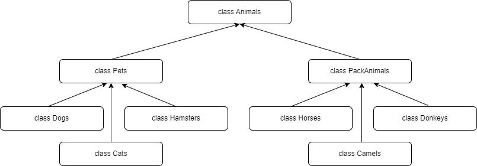

# Итоговая аттестация по блоку специализация
* **

## *Задание по Linux*
* **
1. Используя команду cat в терминале операционной системы Linux, создать
   два файла Домашние животные (заполнив файл собаками, кошками,
   хомяками) и Вьючные животными заполнив файл Лошадьми, верблюдами и
   ослы), а затем объединить их. Просмотреть содержимое созданного файла.
   Переименовать файл, дав ему новое имя (Друзья человека).
````bash
ubuntu@example:~/gb$ cat > 'Домашние животные'
собаки
кошки
хомяки
ubuntu@example:~/gb$ cat > 'Вьючные животные'
лошади
верблюды
ослы
ubuntu@example:~/gb$ cat 'Домашние животные' 'Вьючные животные' > 'Животные'
ubuntu@example:~/gb$ cat 'Животные'
собаки
кошки
хомяки
лошади
верблюды
ослы
ubuntu@example:~/gb$ mv 'Животные' 'Друзья человека'
````
2. Создать директорию, переместить файл туда.
````bash
ubuntu@example:~/gb$ mkdir animals
ubuntu@example:~/gb$ mv 'Друзья человека' animals/'Друзья человека'
ubuntu@example:~/gb$ ls -la animals
total 12
drwxrwxr-x 2 example example 4096 Jan 30 14:10  .
drwxrwxr-x 3 example example 4096 Jan 30 14:10  ..
-rw-rw-r-- 1 example example   76 Jan 30 13:08 'Друзья человека'
````
3. Подключить дополнительный репозиторий MySQL. Установить любой пакет
   из этого репозитория.
````bash
ubuntu@example:~/gb$ sudo apt-key adv --keyserver pgp.mit.edu --recv-keys 3A79BD29
ubuntu@example:~/gb$ sudo echo 'deb http://repo.mysql.com/apt/ubuntu/ bionic mysql-8.0' > /etc/apt/sources.list.d/mysql.list
ubuntu@example:~/gb$ sudo apt update
Hit:1 http://ru.archive.ubuntu.com/ubuntu jammy InRelease
Hit:2 http://ru.archive.ubuntu.com/ubuntu jammy-updates InRelease
Hit:3 http://repo.mysql.com/apt/ubuntu bionic InRelease
Hit:4 http://ru.archive.ubuntu.com/ubuntu jammy-backports InRelease
Hit:5 http://ru.archive.ubuntu.com/ubuntu jammy-security InRelease
Reading package lists... Done
Building dependency tree... Done
Reading state information... Done
All packages are up to date.
ubuntu@example:~/gb$ sudo apt install mysql-common
Reading package lists... Done
Building dependency tree... Done
Reading state information... Done
The following NEW packages will be installed:
  mysql-common
0 upgraded, 1 newly installed, 0 to remove and 0 not upgraded.
Need to get 69.3 kB of archives.
After this operation, 91.1 kB of additional disk space will be used.
Get:1 http://repo.mysql.com/apt/ubuntu bionic/mysql-8.0 amd64 mysql-common amd64 8.0.32-1ubuntu18.04 [69.3 kB]
Fetched 69.3 kB in 0s (462 kB/s)
Selecting previously unselected package mysql-common.
(Reading database ... 74006 files and directories currently installed.)
Preparing to unpack .../mysql-common_8.0.32-1ubuntu18.04_amd64.deb ...
Unpacking mysql-common (8.0.32-1ubuntu18.04) ...
Setting up mysql-common (8.0.32-1ubuntu18.04) ...
update-alternatives: using /etc/mysql/my.cnf.fallback to provide /etc/mysql/my.cnf (my.cnf) in auto mode
Scanning processes...
Scanning linux images...

Running kernel seems to be up-to-date.

No services need to be restarted.

No containers need to be restarted.

No user sessions are running outdated binaries.

No VM guests are running outdated hypervisor (qemu) binaries on this host.
ubuntu@example:~/gb$
````
4. Установить и удалить deb-пакет с помощью dpkg.
````bash
ubuntu@example:~/gb$ apt download lftp
Get:1 http://ru.archive.ubuntu.com/ubuntu jammy/main amd64 lftp amd64 4.9.2-1build1 [720 kB]
Fetched 720 kB in 0s (3,197 kB/s)
ubuntu@example:~/gb$ sudo dpkg -i lftp_4.9.2-1build1_amd64.deb
(Reading database ... 74009 files and directories currently installed.)
Preparing to unpack lftp_4.9.2-1build1_amd64.deb ...
Unpacking lftp (4.9.2-1build1) over (4.9.2-1build1) ...
Setting up lftp (4.9.2-1build1) ...
Processing triggers for man-db (2.10.2-1) ...
ubuntu@example:~/gb$ sudo dpkg -r lftp
(Reading database ... 74009 files and directories currently installed.)
Removing lftp (4.9.2-1build1) ...
Processing triggers for man-db (2.10.2-1) ...
ubuntu@example:~/gb$
````
5. Выложить историю команд в терминале ubuntu.
````bash
ubuntu@example:~/gb$ history
    1  cat > 'Домашние животные'
    2  cat > 'Вьючные животные'
    3  cat 'Домашние животные' 'Вьючные животные' > 'Животные'
    4  cat 'Животные'
    5  mv 'Животные' 'Друзья человека'
    6  mkdir animals
    7  mv 'Друзья человека' animals/'Друзья человека'
    8  ls -la animals
    9  sudo apt-key adv --keyserver pgp.mit.edu --recv-keys 3A79BD29
   10  sudo echo 'deb http://repo.mysql.com/apt/ubuntu/ bionic mysql-8.0' > /etc/apt/sources.list.d/mysql.list
   11  sudo apt update
   12  sudo apt install mysql-common
   13  apt download lftp
   14  sudo dpkg -i lftp_4.9.2-1build1_amd64.deb
   15  sudo dpkg -r lftp
   16  history
ubuntu@example:~/gb$
````
* **
## *Задание по базам данных*
* **
6. Нарисовать диаграмму, в которой есть класс родительский класс, домашние
   животные и вьючные животные, в составы которых в случае домашних
   животных войдут классы: собаки, кошки, хомяки, а в класс вьючные животные
   войдут: Лошади, верблюды и ослы).
   
7. В подключенном MySQL репозитории создать базу данных “Друзья
   человека”
```sql
CREATE DATABASE companions;
```
8. Создать таблицы с иерархией из диаграммы в БД
```sql
USE companions;

CREATE TABLE animals
(
	id INT AUTO_INCREMENT PRIMARY KEY,
	animal_type VARCHAR(30)
);

INSERT INTO animals (animal_type)
VALUES ('Домашние животные'), ('Вьючные животные');

CREATE TABLE pets
(
	id INT AUTO_INCREMENT PRIMARY KEY,
	animal_kind VARCHAR(30),
	animal_type_id INT DEFAULT 1,
	FOREIGN KEY (animal_type_id) REFERENCES animals (id) ON DELETE CASCADE ON UPDATE CASCADE
);

INSERT INTO pets (animal_kind)
VALUES ('Собаки'), ('Кошки'), ('Хомяки');

CREATE TABLE pack_animals
(
	id INT AUTO_INCREMENT PRIMARY KEY,
	animal_kind VARCHAR(30),
	animal_type_id INT DEFAULT 2,
	FOREIGN KEY (animal_type_id) REFERENCES animals (id) ON DELETE CASCADE ON UPDATE CASCADE
);

INSERT INTO pack_animals (animal_kind)
VALUES ('Лошади'), ('Верблюды'), ('Ослы');
```
9. Заполнить низкоуровневые таблицы именами(животных), командами
   которые они выполняют и датами рождения.
```sql
CREATE TABLE dogs 
(       
    id INT AUTO_INCREMENT PRIMARY KEY, 
    name VARCHAR(30), 
    commands VARCHAR(100),
    birthday DATE,
    animal_kind_id INT DEFAULT 1,
    Foreign KEY (animal_kind_id) REFERENCES pets (id) ON DELETE CASCADE ON UPDATE CASCADE
);
INSERT INTO dogs (name, commands, birthday)
VALUES ('Старк', 'лежать, сидеть', '2021-05-28'),
('Бобик', 'дай лапу, фас', '2016-05-08'),
('Снежок', 'место, голос', '2020-03-25');

CREATE TABLE cats 
(       
    id INT AUTO_INCREMENT PRIMARY KEY, 
    name VARCHAR(30), 
    commands VARCHAR(100),
    birthday DATE,
    animal_kind_id INT DEFAULT 2,
    Foreign KEY (animal_kind_id) REFERENCES pets (id) ON DELETE CASCADE ON UPDATE CASCADE
);
INSERT INTO cats (name, commands, birthday)
VALUES ('Мурзик', 'стоять', '2021-03-14'),
('Мурка', 'дай лапу', '2017-03-09'),
('Кузя', 'ко мне', '2019-02-21');

CREATE TABLE hamsters 
(       
    id INT AUTO_INCREMENT PRIMARY KEY, 
    name VARCHAR(30), 
    commands VARCHAR(100),
    birthday DATE,
    animal_kind_id INT DEFAULT 3,
    Foreign KEY (animal_kind_id) REFERENCES pets (id) ON DELETE CASCADE ON UPDATE CASCADE
);
INSERT INTO hamsters (name, commands, birthday)
VALUES ('Рыжик', 'стоять', '2021-06-11'),
('Умка', 'гулять', '2016-02-19'),
('Черныш', 'кушать', '2019-04-21');

CREATE TABLE horses 
(       
    id INT AUTO_INCREMENT PRIMARY KEY, 
    name VARCHAR(30), 
    commands VARCHAR(100),
    birthday DATE,
    animal_kind_id INT DEFAULT 1,
    Foreign KEY (animal_kind_id) REFERENCES pack_animals (id) ON DELETE CASCADE ON UPDATE CASCADE
);
INSERT INTO horses (name, commands, birthday)
VALUES ('Призрак', 'тише, хоп, вперед', '2021-03-12'),
('Орхидея', 'стой, рысь, шагом', '2016-05-15'),
('Кондор', 'стой, шагом, хоп', '2018-02-27');

CREATE TABLE camels 
(       
    id INT AUTO_INCREMENT PRIMARY KEY, 
    name VARCHAR(30), 
    commands VARCHAR(100),
    birthday DATE,
    animal_kind_id INT DEFAULT 2,
    Foreign KEY (animal_kind_id) REFERENCES pack_animals (id) ON DELETE CASCADE ON UPDATE CASCADE
);
INSERT INTO camels (name, commands, birthday)
VALUES ('Лила', 'гит, дурр', '2021-02-15'),
('Хлоя', 'дурр', '2016-11-05'),
('Джоси', 'каш, гит', '2017-07-21');

CREATE TABLE donkeys 
(       
    id INT AUTO_INCREMENT PRIMARY KEY, 
    name VARCHAR(30), 
    commands VARCHAR(100),
    birthday DATE,
    animal_kind_id INT DEFAULT 3,
    Foreign KEY (animal_kind_id) REFERENCES pack_animals (id) ON DELETE CASCADE ON UPDATE CASCADE
);
INSERT INTO donkeys (name, commands, birthday)
VALUES ('Чоко', 'вперед, стоять', '2020-03-19'),
('Денвер', 'идти, стоять', '2017-10-15'),
('Изабель', 'шагом, вперед', '2022-08-24');
```
10. Удалив из таблицы верблюдов, т.к. верблюдов решили перевезти в другой
    питомник на зимовку. Объединить таблицы лошади, и ослы в одну таблицу.
```sql
DELETE FROM camels;

CREATE TABLE horses_and_donkeys SELECT * FROM horses
UNION SELECT * FROM donkeys;
```
11. Создать новую таблицу “молодые животные” в которую попадут все
    животные старше 1 года, но младше 3 лет и в отдельном столбце с точностью
    до месяца подсчитать возраст животных в новой таблице
```sql
CREATE TEMPORARY TABLE all_animals
SELECT * FROM dogs
UNION SELECT * FROM cats
UNION SELECT * FROM hamsters
UNION SELECT * FROM horses
UNION SELECT * FROM camels
UNION SELECT * FROM donkeys;

CREATE TABLE young_animals
SELECT name, commands, birthday, animal_kind_id, TIMESTAMPDIFF(MONTH, birthday, CURDATE()) AS age_in_month
FROM all_animals
WHERE birthday BETWEEN ADDDATE(CURDATE(), INTERVAL -3 YEAR) AND ADDDATE(CURDATE(), INTERVAL -1 YEAR);
```
12. Объединить все таблицы в одну, при этом сохраняя поля, указывающие на
    прошлую принадлежность к старым таблицам.
```sql
SELECT dogs.name, dogs.commands, dogs.birthday, pets.animal_kind, animals.animal_type
FROM dogs
LEFT JOIN pets ON pets.id = dogs.animal_kind_id
LEFT JOIN animals ON animals.id=pets.animal_type_id
UNION
SELECT cats.name, cats.commands, cats.birthday, pets.animal_kind, animals.animal_type
FROM cats
LEFT JOIN pets ON pets.id = cats.animal_kind_id
LEFT JOIN animals ON animals.id=pets.animal_type_id
UNION
SELECT hamsters.name, hamsters.commands, hamsters.birthday, pets.animal_kind, animals.animal_type
FROM hamsters
LEFT JOIN pets ON pets.id = hamsters.animal_kind_id
LEFT JOIN animals ON animals.id=pets.animal_type_id
UNION
SELECT horses.name, horses.commands, horses.birthday, pack_animals.animal_kind, animals.animal_type
FROM horses
LEFT JOIN pack_animals ON pack_animals.id = horses.animal_kind_id
LEFT JOIN animals ON animals.id=pack_animals.animal_type_id
UNION
SELECT camels.name, camels.commands, camels.birthday, pack_animals.animal_kind, animals.animal_type
FROM camels
LEFT JOIN pack_animals ON pack_animals.id = camels.animal_kind_id
LEFT JOIN animals ON animals.id=pack_animals.animal_type_id
UNION
SELECT donkeys.name, donkeys.commands, donkeys.birthday, pack_animals.animal_kind, animals.animal_type
FROM donkeys
LEFT JOIN pack_animals ON pack_animals.id = donkeys.animal_kind_id
LEFT JOIN animals ON animals.id=pack_animals.animal_type_id;
```
* **
## *Приложение система учёта питомника (Java)*
* **
### Описание
Консольное приложение **Учёт питомника** имитирует работу реестра домашних животных. Реестр животных сохраняется в файле _**animals.csv**_. В программе реализованы следующие функции:
* просмотр списка всех животных в питомнике
* добавление нового животного с определением в правильный класс
* просмотр команд указанного животного
* обучение животного новым командам
* навигация организована через меню
* по требованию задания создан класс _**Counter**_ в файле _**nursery/src/view/View.java**_

### Запуск приложения
Запуск приложения осуществляется через файл _**nursery/src/Main.java**_
* **